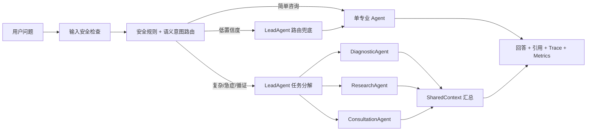

# MediX：可评测的自适应多智能体医疗助手

[](https://github.com/gakkijj/Medical-Assistant/actions/workflows/ci.yml)
[](https://www.python.org/)
[](LICENSE)

MediX 是一个面向医疗健康咨询场景的 Agent 工程项目。它不把“所有问题都交给多个 Agent”，而是通过“安全规则 → 语义意图 → 低置信度 LLM 兜底”的三级路由判断计算路径：简单问题直接进入单 Agent，复杂症状、急症信号和循证问题才启动 LeadAgent 与并行 Swarm。

项目重点展示三个工程闭环：

- **自适应路由**：复杂度与 Agent 意图解耦，支持否定句、口语急症、置信度和低置信度兜底。
- **可评测 RAG**：章节感知切片、BM25、哈希字符向量、融合重排和可定位引用均可离线回归。
- **全链路可观测**：记录路由依据、LLM/Skill 调用、Token、耗时和引用来源，不记录 Trace 原始医疗文本。
- **生产化接口**：请求状态隔离、并发槽、超时、SSE 生命周期事件、安全输入检查和 Prometheus 指标。
- **可复现评测**：无模型 Key即可运行路由与检索 Benchmark；在线回答可保存后离线评测安全召回、引用覆盖、延迟和 Token。

> 本项目仅用于学习和研究，不能替代医生诊断或治疗。紧急症状请立即就医或拨打当地急救电话。

## 为什么不是“所有请求都用 Multi-Agent”

旧方案每个请求都先调用 LeadAgent，再决定单 Agent 或 Swarm；简单问题虽然最终只使用一个 Agent，仍然承担了一次额外规划调用。

现在的路由流程如下：



路由会返回完整依据，例如：

```json
{
  "mode": "swarm",
  "intent": "diagnosis",
  "primary_agent": "diagnostic_agent",
  "recommended_agents": ["diagnostic_agent", "consultation_agent"],
  "complexity_score": 5,
  "confidence": 1.0,
  "risk_level": "emergency",
  "router_stage": "safety_rule",
  "reason_codes": ["emergency_signal"],
  "lead_planning_required": true
}
```

## 离线 Benchmark

运行：

```bash
make benchmark
```

当前回归集包含40条人工标注用例，覆盖简单咨询、否定句、口语表达、多症状、既往史、循证问题和急症信号。结果来自仓库中的真实可执行脚本：

| 策略 | 路由准确率 | Swarm 使用率 | LeadAgent 规划率 |
|---|---:|---:|---:|
| 全部单 Agent | 45.0% | 0.0% | 0.0% |
| 全部 Swarm | 55.0% | 100.0% | 100.0% |
| **自适应路由** | **100.0%** | **55.0%** | **55.0%** |

- 主 Agent 选择准确率：**100.0%**
- 路由 Macro-F1：**100.0%**
- 急症信号召回率：**100.0%**
- 平均路由置信度：**94.8%**
- 详细结果：[evaluation/reports/latest.md](medix-agent-swarm/evaluation/reports/latest.md)

这些数字只表示小型确定性路由回归集的结果，**不是医疗回答准确率或临床有效性声明**。用例透明存放在 [cases.jsonl](medix-agent-swarm/evaluation/cases.jsonl)，便于审查和扩充。

### 检索消融

12条检索用例对同一演示语料比较 BM25、哈希字符向量和加权融合：

| 策略 | Recall@5 | MRR | Hit Rate@5 |
|---|---:|---:|---:|
| BM25 | 100.0% | 91.7% | 100.0% |
| 字符向量 | 100.0% | 86.1% | 100.0% |
| 加权融合 | 100.0% | 87.5% | 100.0% |

在当前小型、高关键词重合语料上 BM25 最好；项目如实保留该结果。演示数据并非经过临床审核的生产知识库，详见 [数据说明](medix-agent-swarm/knowledge/data/README.md)。

### 在线回答评测

将不同策略的回答保存为 JSONL 后，可以在不再次调用模型的情况下比较：

- 必要关键词覆盖率
- 急症就医建议召回率
- 循证问题引用覆盖率
- 检索 Recall@K 与 MRR
- P50/P95 延迟
- 平均 Token 和 LLM 调用次数

```bash
cd medix-agent-swarm
python evaluation/run_benchmark.py \
  --predictions evaluation/predictions.jsonl \
  --output-dir evaluation/reports/adaptive
```

预测记录格式：

```json
{"id":"emergency_chest","answer":"...","citations":[],"latency_seconds":2.4,"total_tokens":820,"llm_call_count":3}
```

## 核心能力

- 3 个专业 Worker：健康咨询、诊断推理、循证研究
- 9 个可动态加载 Skill：知识检索、症状分析、风险评估、指南检索、DeepResearch、记忆检索等
- 默认可回归的 BM25/字符向量混合检索，可切换 Milvus Lite + BGE Embedding
- Agent Loop：Think → Tool Call → Observe → Final Answer
- SharedContext 驱动的并行 Swarm 协作
- 内存/Redis 短期记忆与可选 Mem0 长期记忆
- FastAPI + 原生 Web 前端
- 输入/输出约束、Skill 调用上限与医疗免责声明
- 来源引用、请求级 Trace、Token/延迟/工具调用指标

## 快速开始

### 方式一：离线验证，无需 API Key

只需要 Python 3.10+：

```bash
make test-offline
make benchmark
```

### 方式二：本地运行

```bash
cp .env.example .env
# 编辑 .env，至少填写 LLM_API_KEY

cd medix-agent-swarm
python -m venv .venv
source .venv/bin/activate
pip install -r requirements.txt
uvicorn api.app:app --host 127.0.0.1 --port 8000
```

浏览器访问 <http://127.0.0.1:8000>。

### 方式三：Docker Compose

```bash
cp .env.example .env
# 填写 LLM_API_KEY
docker compose up --build
```

默认使用无需下载模型的混合检索。设置 `MEDIX_RETRIEVER=milvus` 后使用 BGE + Milvus Lite，数据库持久化在 Docker volume 中。

## 配置

| 环境变量 | 必填 | 说明 |
|---|---|---|
| `LLM_API_KEY` | 是 | OpenAI-compatible API Key |
| `LLM_MODEL_NAME` | 否 | 默认 `deepseek-chat` |
| `LLM_BASE_URL` | 否 | 默认 `https://api.deepseek.com` |
| `MEM0_API_KEY` | 否 | 留空时禁用云端长期记忆 |
| `MEDIX_CORS_ORIGINS` | 否 | 允许访问 API 的浏览器来源 |
| `MEDIX_RETRIEVER` | 否 | 默认 `hybrid`，可设为 `milvus` |
| `MEDIX_MAX_CONCURRENCY` | 否 | API 最大并发执行数，默认8 |
| `MEDIX_REQUEST_TIMEOUT_SECONDS` | 否 | 单请求超时，默认120秒 |
| `MEDIX_EXPOSE_RAW_RESPONSE` | 否 | 调试时返回内部原始结果，默认关闭 |
| `MILVUS_DB_PATH` | 否 | Milvus Lite 数据库路径 |

真实密钥只放在 `.env`；`.env`、Claude 本地设置、会话摘要、IDE 配置和运行时数据库均不会进入 Git。

## API 可观测字段

`POST /api/chat` 除回答外还返回：

```json
{
  "route": {"mode": "single", "reason_codes": ["simple_request"]},
  "llm_call_count": 1,
  "tool_call_count": 1,
  "prompt_tokens": 320,
  "completion_tokens": 180,
  "total_tokens": 500,
  "citations": [{"title": "...", "source": "...", "score": 0.87}],
  "trace": [
    {"name": "routing", "duration": 0.0002, "metadata": {"mode": "single"}},
    {"name": "llm_call", "duration": 0.82, "metadata": {"success": true}},
    {"name": "tool_call", "duration": 0.13, "metadata": {"tool_name": "search_knowledge"}}
  ]
}
```

请求体中的 `routing_mode` 默认为 `auto`；实验时可设置为 `single` 或 `swarm`，用于在同一套服务上采集消融对比数据。

- `POST /api/chat/stream`：通过 SSE 返回 `accepted/complete/error` 生命周期事件；当前不是逐 Token 流式生成。
- `GET /api/metrics`：Prometheus 文本指标，只包含计数、耗时、结果和路由模式。
- `GET /api/health`：返回协调器状态、并发上限和超时配置。

Trace 只保存操作名称、耗时和计数，不保存问题正文、模型回复或 Tool 参数。

## 测试与 CI

```bash
# 无模型 Key 回归测试（路由、检索、安全、Metrics）
make test-offline

# 安装开发依赖后运行全部 pytest
cd medix-agent-swarm
pip install -r requirements-ci.txt
pytest -q
ruff check api core knowledge/hybrid_retriever.py evaluation tests
```

GitHub Actions 会在 Python 3.10 和3.12上执行源码编译、完整测试、Lint、路由与检索门禁。路由 Accuracy/Macro-F1/主 Agent 准确率低于90%、急症信号召回率低于100%，或混合检索 Recall@5/MRR 低于85%/75%时 CI 失败。

## 项目结构

```text
Medical-Assistant/
├── .github/workflows/ci.yml       # 无 Key CI
├── Dockerfile
├── docker-compose.yml
├── medix-agent-swarm/
│   ├── agents/                    # 3 个 Worker Agent
│   ├── core/
│   │   ├── routing.py             # 零 LLM 自适应路由
│   │   ├── request_metrics.py     # Trace/Token/延迟指标
│   │   ├── service_metrics.py     # Prometheus 聚合指标
│   │   └── agent_loop.py          # Tool Calling 循环
│   ├── evaluation/                # Benchmark、数据集、报告
│   ├── knowledge/                 # 混合检索、Milvus 与演示文档
│   ├── memory/                    # 长短期记忆
│   ├── swarm/                     # LeadAgent 与 SharedContext
│   ├── tests/
│   └── web/
└── README.md
```

## 设计取舍

1. **为什么使用确定性路由？** 让简单问题不消耗一次路由模型调用，决策可解释、可测试，也方便做消融实验。
2. **为什么复杂问题仍保留 LeadAgent？** 规则只判断需要多少计算资源，具体子任务仍由模型根据上下文动态分解。
3. **为什么不直接声称医疗准确率？** 路由回归、检索质量、生成质量和临床有效性是不同层级，必须分别评测。
4. **为什么保留自研 Agent Loop？** 便于展示 Tool Calling、状态管理、Guardrail、Memory 和并发协作的底层实现，而不仅是框架 API 拼装。
5. **为什么融合检索没有超过 BM25？** 当前语料小且关键词重合高，实验显示 BM25 更合适；扩大语料和语义改写集后再判断神经检索收益。

## 后续实验

- 扩展公开医疗评测集并补充人工双盲评分
- 用公开、可授权且有来源元数据的语料替换演示知识库
- 扩展到300+路由用例和100+检索用例并进行人工双标
- 运行单 Agent / RAG / Swarm / Adaptive 四组端到端消融实验
- 引入用户鉴权、速率限制和更完整的隐私生命周期管理

## License

[MIT](LICENSE)
