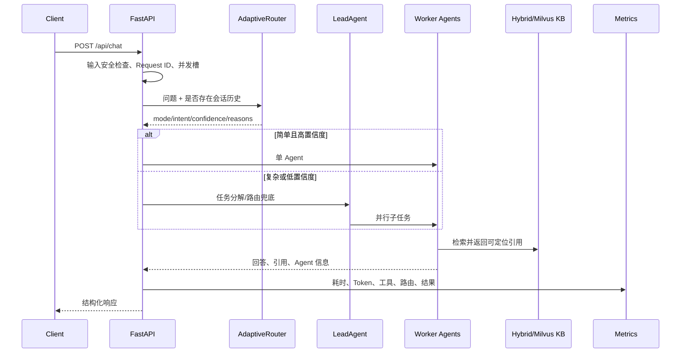

# MediX 架构设计

## 目标

MediX 用医疗咨询作为垂直场景，重点验证 Agent 工程中的四个问题：如何按风险分配计算预算、如何让检索可评测、如何隔离并发状态、如何在不记录原始医疗文本的前提下观测系统。

## 请求链路

## 三级路由

1. 安全规则层对急症口语和否定表达进行高召回检查。
2. 语义词典层独立计算复杂度和意图，复杂度决定 single/swarm，意图决定 Worker。
3. 低置信度或意图并列时调用 LeadAgent，正常简单请求不支付规划调用。

路由器不是诊断模型；`risk_level` 只用于工作流预算与安全升级。

## 并发状态隔离

- `ContextVar` 保存请求级 Trace 和 Token 指标。
- 工具计数是 `AgentLoop.run()` 局部变量，不共享到其他请求。
- `SharedContext` 通过参数传入 Worker，不再写入共享 Agent 实例。
- 短期与长期记忆均按 `session_id` 分桶。
- API 通过信号量限制外部 LLM 压力，不再用全局锁串行全部请求。

## 检索

默认检索链路是章节感知切片、BM25、哈希字符向量、加权 RRF 和标题重排。该实现不依赖模型下载，适合 CI 回归。`MEDIX_RETRIEVER=milvus` 可切换 BGE + Milvus Lite。

检索结果携带 `doc_id/chunk_id/title/section/source/score`。包含提示词注入模式的知识块不会进入上下文。

## 故障边界

- 单请求总超时由 `MEDIX_REQUEST_TIMEOUT_SECONDS` 控制。
- Swarm Worker 使用 `gather(return_exceptions=True)`，部分失败时仍可汇总已完成贡献。
- 低置信度路由无法解析时回退到确定性路由结果。
- Mem0 未配置时自动禁用，不阻塞基本问答。
- API 对调用方隐藏内部异常，只记录异常类型和请求标识。

